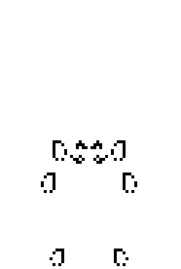
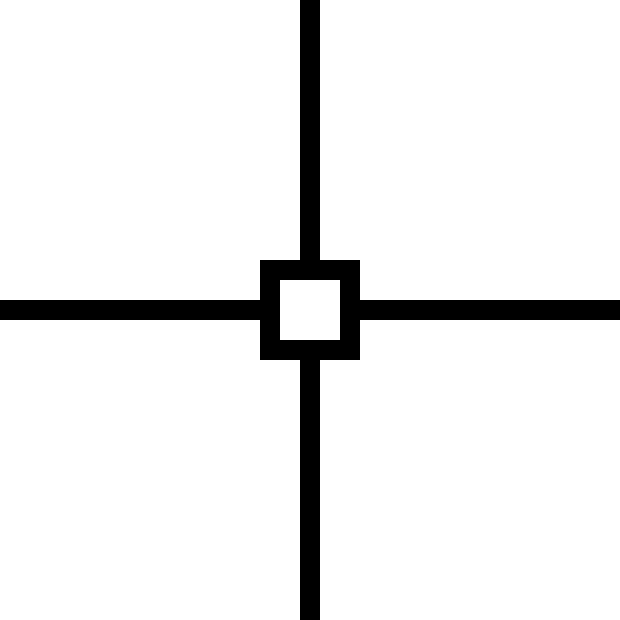
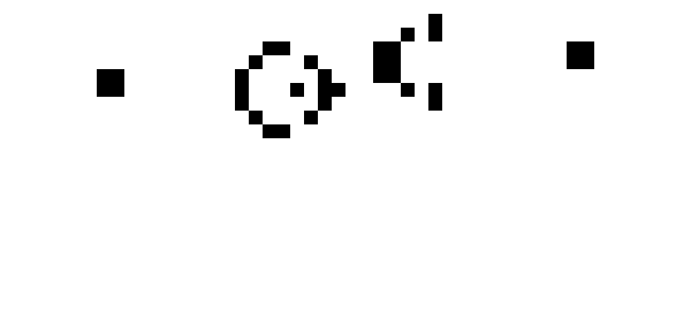
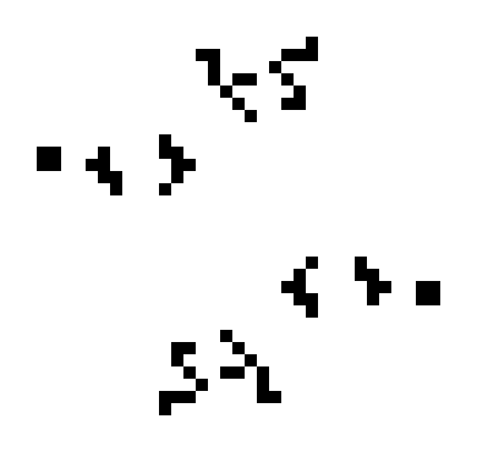
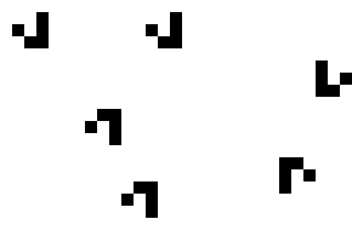

# Conway's game of life Prolog implementation

To start the game run start_game(+InputFramePath, +GenNumber). Parameters description:
- InputFramePath - path to the file with initial field, see input_frames folder for the inspiration
- GenNumber - number of generations to run

Run frames2gif.py to convert output frames to gif.

  
  
  
  
  
  
  

